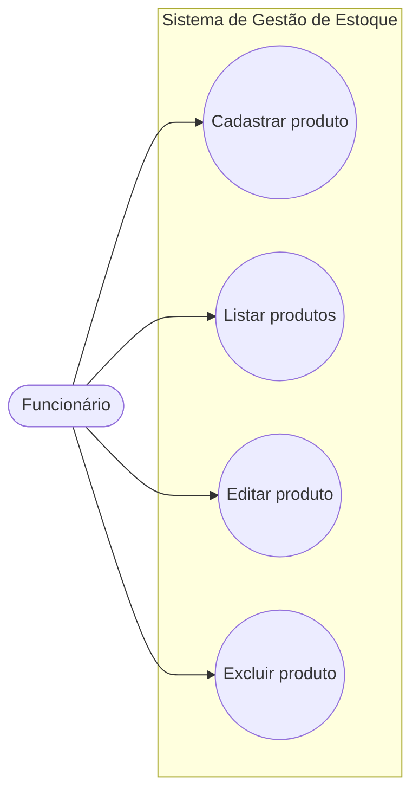

# Documentação de Caso de Uso

## Diagrama

## Ator

| Ator | Descrição |
|------|-----------|
| Funcionário | Responsável por controlar os produtos do estoque do mercado. |

## Casos de uso

| Caso de uso | Descrição |
|-------------|-----------|
| Cadastrar produto | O funcionário preenche nome, categoria, descrição, preço, quantidade e validade. O sistema valida e salva. |
| Listar produtos | O sistema mostra todos os produtos cadastrados em uma tabela. |
| Editar produto | O funcionário altera os dados de um produto existente. O sistema valida e atualiza. |
| Excluir produto | O funcionário confirma a exclusão e o sistema remove o produto. |

## Fluxo alternativo (cadastrar/editar)
Se algum dado for inválido, o sistema mostra as mensagens de erro e mantém o formulário preenchido.